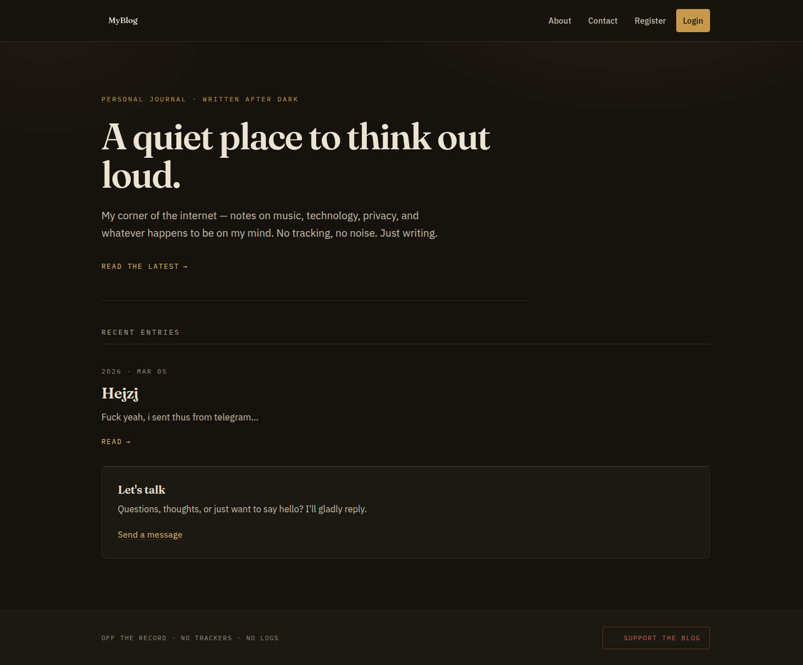
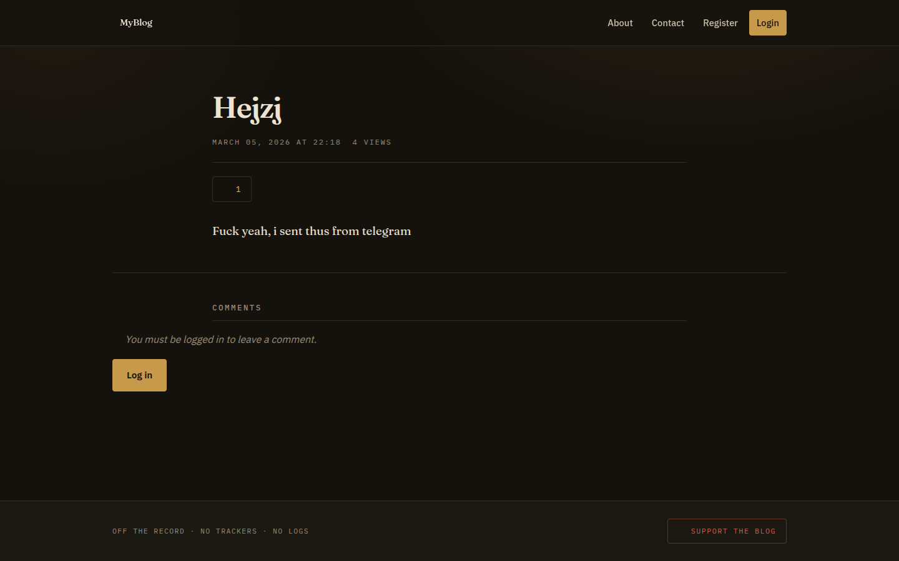
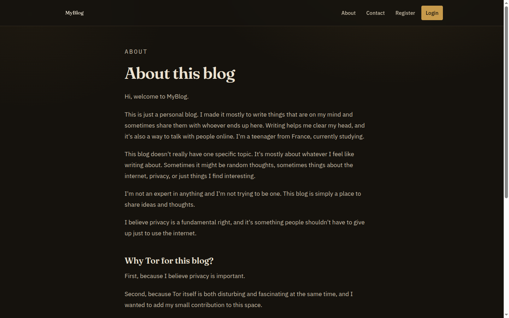

# TechBlog

🇬🇧 English · [🇫🇷 Français](README.fr.md)

> **⚠️ Security updates (September 2026):** critical vulnerabilities fixed, all
> dependencies upgraded past their CVEs, the site now runs with **zero JavaScript
> and zero third-party requests**. **Update with `./update.sh`, or turn on
> automatic updates (`./auto-update.sh enable weekly`).** Details in [SECURITY.md](SECURITY.md).

> **Vibe coded.** This project was built with heavy help from AI coding tools.
> It has been reviewed and is covered by security regression tests, but read the
> code before trusting it with anything sensitive, and report anything odd.

A privacy-first blog built with Flask. No JavaScript, no trackers, no third-party
fonts or CDNs: it works in Tor Browser at the "Safest" level and can be served as
a `.onion` site.






## Features

- **No JavaScript at all**: every page works with JS disabled (the CSP even sets `script-src 'none'`)
- **No third-party requests**: self-hosted fonts, no CDN, no embedded widgets, external images shown as links
- **Tor ready**: `Onion-Location` header, onion service config in `deploy/`
- **Night Desk UI**: warm, lamplit dark theme (customizable, see [CUSTOMIZE_THEME.md](CUSTOMIZE_THEME.md))
- **Posts** written in BBCode (or basic HTML), drafts, scheduled posts, revisions
- **Nested comments** with BBCode, likes, notifications, XP, levels and badges
- **Private encrypted chat** between each user and the admin (Fernet, at rest)
- **TOTP two-factor authentication**
- **Telegram admin bot** (optional) and **mobile admin API** (Basic Auth + TOTP, SSE)
- **Static pages, banners, contact form, crypto donations** (QR codes generated server-side)
- **Safe updates**: `./update.sh` (backup, update, health check, automatic rollback), optional automatic updates at the frequency you choose, encrypted backups

## Tech Stack

- **Backend**: Flask, SQLAlchemy (SQLite), Flask-Login, Flask-WTF, Flask-SocketIO
- **Security**: bcrypt, Fernet encryption, pyotp (TOTP), nh3 (HTML sanitizer), strict CSP
- **Frontend**: HTML5 + CSS3 only
- **Typography**: Fraunces + IBM Plex Sans + IBM Plex Mono (self-hosted, SIL OFL)
- **Icons**: monochrome SVG mask icons (no JS, no web font)

## Quick Start

New to this? The [5-Minute Setup Guide](SETUP_GUIDE.md) helps you personalize the blog.

```bash
git clone https://github.com/kerstz/blog-privacy.git
cd blog-privacy
python3 -m venv venv && source venv/bin/activate
pip install -r requirements.txt
cp .env.example .env        # then fill in the secrets (see below)
flask db upgrade
python create_admin.py
python wsgi.py              # development server on http://127.0.0.1:5000
```

Generate each secret in `.env` with:

```bash
python -c "import secrets; print(secrets.token_urlsafe(48))"
```

The app refuses to start with missing or example secrets. **Back up
`ENCRYPTION_KEY` and `ENCRYPTION_SALT`**: without them the chat history can never
be decrypted again.

## Production

Ready-to-use files are in [`deploy/`](deploy/):

| File | Purpose |
|------|---------|
| `blog.service` | systemd unit: dedicated unprivileged user, sandboxing, gunicorn on 127.0.0.1 |
| `Caddyfile` | reverse proxy with automatic HTTPS, no access logs |
| `nginx.conf` | alternative reverse proxy (with certbot) |
| `torrc.example` | onion service (then set `ONION_ADDRESS` in `.env`) |

In `.env`: `SESSION_COOKIE_SECURE=true` (HTTPS) and `TRUSTED_PROXY_COUNT=1`
(behind the reverse proxy). Enable 2FA on every admin account.

## Updates (important)

New vulnerabilities are published every week. **Keep the blog updated.**

```bash
./update.sh                          # update now
./auto-update.sh enable weekly       # automatic updates: daily | weekly | monthly | "<cron>"
./auto-update.sh status
./auto-update.sh disable
```

`update.sh` backs up the database and uploads, pulls the code (fast-forward only),
upgrades the dependencies, applies migrations, checks the app starts (and runs the
tests when pytest is installed) and **rolls back automatically** if anything fails.
It never touches the database content, `uploads/` or `.env`. Automatic updates are
**off by default**; with `UPDATE_RESTART_CMD` set in `.env` the app is restarted
after each successful update, and the Telegram bot (if configured) tells you what
happened.

## Backups

```bash
./backup.sh run                     # encrypted backup of databases + uploads + .env
./backup.sh enable daily            # daily | weekly | "<cron>"
./backup.sh restore <file> <dir>    # decrypt into a NEW folder (never overwrites live data)
```

Set `BACKUP_PASSPHRASE` in `.env` and keep a copy of it outside the server.
`BACKUP_REMOTE` (optional) copies each backup off-site with rsync.

## Writing posts

Posts, comments and replies use BBCode: see `/editor_help` on your blog.
External images (`[img]https://...[/img]`) are shown as links and never loaded,
so readers' IP addresses are never sent to other sites. Upload images to the blog
to embed them.

## Admin

- Web admin panel: `/admin_dashboard` (posts, users, comments, banners, pages, statistics, chat)
- Telegram bot: set `TELEGRAM_BOT_TOKEN`, `TELEGRAM_ADMIN_CHAT_ID`, `TELEGRAM_ADMIN_USER_ID` and `TELEGRAM_ADMIN_PIN`

### Admin Mobile Chat API

- `GET /api/admin/mobile/ping` - test admin authentication
- `GET /api/admin/mobile/conversations` - list users and last message per conversation
- `GET /api/admin/mobile/conversations/<user_id>/messages?limit=50` - fetch a conversation history
- `POST /api/admin/mobile/conversations/<user_id>/messages` - send/reply to a user
- `GET /api/admin/mobile/stream` - real-time event stream (SSE)

Authentication: HTTP Basic Auth with an admin account. If the account has 2FA
enabled, also send the current code in the `X-TOTP-Code` header. Failed logins
are rate limited.

```bash
curl -u admin:your_password -H "X-TOTP-Code: 123456" \
  https://blog.example.org/api/admin/mobile/conversations
```

## Project Structure

```
app/
  __init__.py       app setup, extensions, template filters
  routes.py         web routes + SocketIO handlers
  services.py       shared helpers (auth, uploads, chat, deletion cascades)
  telegram_bot.py   optional Telegram admin bot
  mobile_api.py     mobile admin REST API
  models.py forms.py utils.py encryption.py
  static/           css/, fonts/ (self-hosted)
  templates/        Jinja2 templates (no JavaScript)
deploy/             systemd, Caddy, nginx, Tor examples
docs/               screenshots, UI demos
migrations/         Alembic migrations
tests/              security regression tests
update.sh auto-update.sh backup.sh
```

## Tests

```bash
pip install -r requirements-dev.txt
pytest -q tests/
pip-audit -r requirements.txt
```

The same checks run on GitHub Actions for every push and every Monday, and
Dependabot opens pull requests for dependency updates.

## Security

- Passwords hashed with bcrypt; TOTP 2FA (brute-force and replay protected)
- CSRF protection, strict CSP (`script-src 'none'`), HSTS in HTTPS, COOP/CORP
- All user HTML escaped and sanitized (`nh3`); uploads access controlled, metadata stripped
- Chat messages encrypted at rest, private per user
- Persistent rate limiting (login, 2FA, API, comments, chat, Telegram PIN)
- Encrypted backups, safe updates with rollback

See [SECURITY.md](SECURITY.md) for the full changelog and how to report a vulnerability.

## Theme Customization

See the [Theme Customization Guide](CUSTOMIZE_THEME.md): pre-made color schemes,
step-by-step instructions and an AI prompt template.

## Future Enhancements
 I don't really know if i have the time for this but why not add this in the future :)
- [ ] Search functionality
- [ ] Categories and tags
- [ ] RSS feed
- [ ] Email notifications
- [ ] OAuth integration
- [ ] Image upload and management
- [ ] Markdown support
- [ ] SEO optimization
- [ ] Multi-language support

## Contributing

Contributions are welcome! Fork the project, create a feature branch, commit and open a Pull Request.

## License

MIT License.
